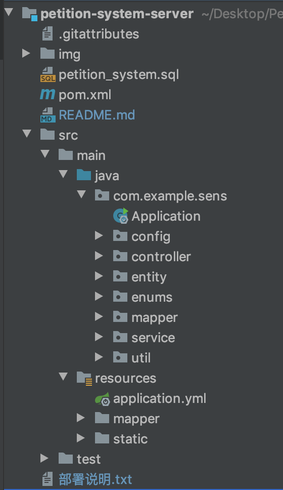
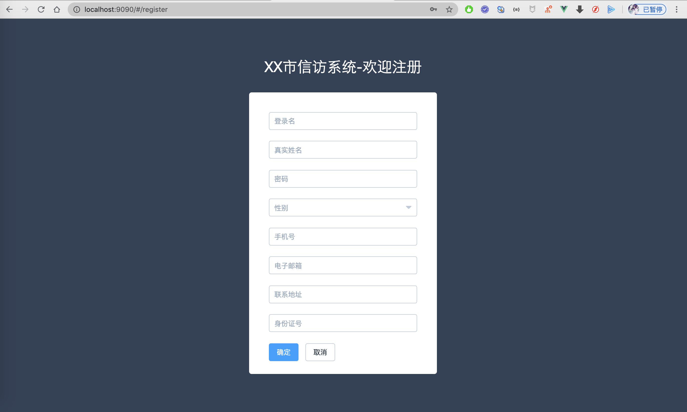
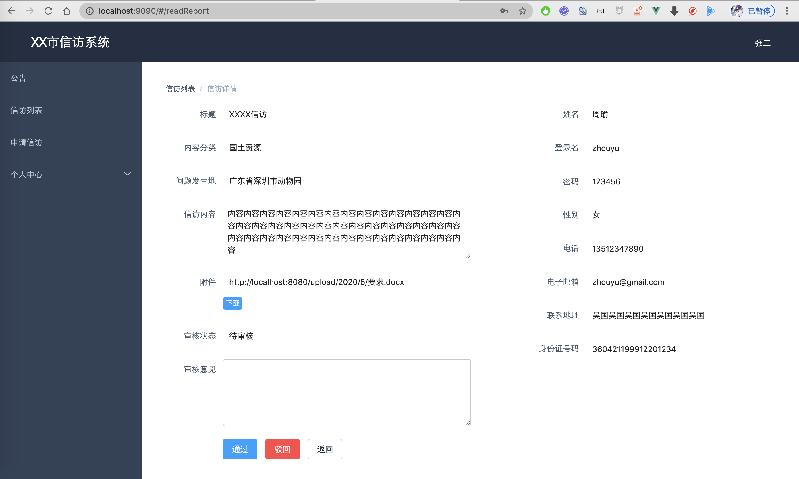
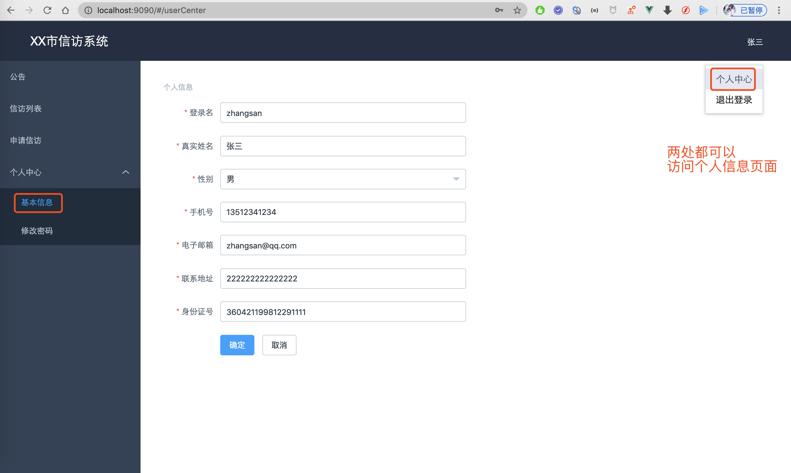
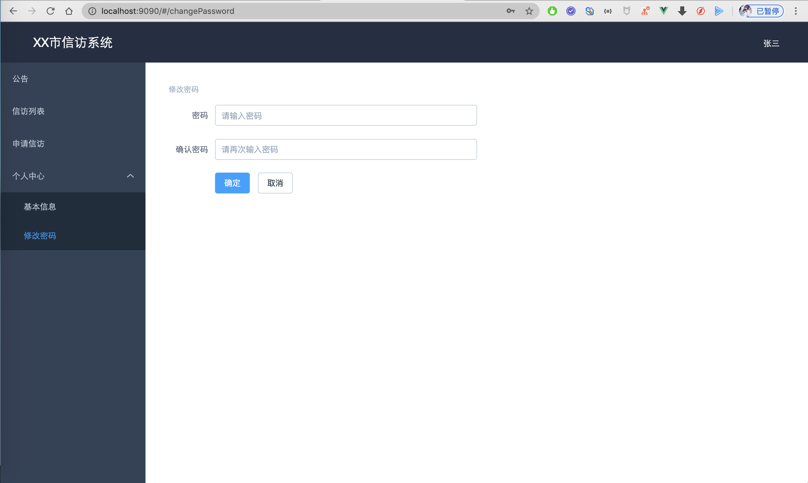

## 项目介绍
该项目基于 SpringBoot 2.x + Vue Element UI 实现，该项目目前是一个信访系统，有用户、事业单位员工和领导三种业务角色。
大家可以根据自己的需求随便改成其他系统。

## 技术组成
- Vue2.x
- SpringBoot 2.x
- MyBatis / MyBatis Plus
- MySQL

## 项目结构
1. 后台结构

2. 前端结构

3. 数据库结构

注：其中log表是用户操作记录表，根据AOP实现

## 项目预览
1. 登录页面

2. 注册页面

3. 案件列表

4. 创建案件

5. 案件详情

6. 个人信息

7. 修改密码

## 关于前端代码
目前已经把前端代码打包放到 static 目录，可以直接访问使用。  
前端 vue 代码将放在另一个仓库 [http://github.com/saysky/vue-petition-system](http://github.com/saysky/vue-petition-system)   
或者联系博主：微信 847064370 获取
